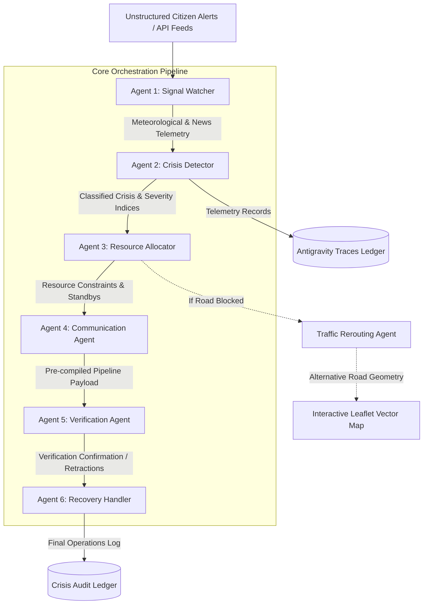

# 🛡️ CIRO — Crisis Intelligence & Response Orchestrator
### 🇵🇰 Islamabad Capital Territory (ICT) Emergency Operations Console

CIRO (Crisis Intelligence & Response Orchestrator) is a production-grade, state-of-the-art emergency orchestration framework architected for Islamabad, Pakistan. The platform bridges real-time unstructured signals (meteorological telemetry, public news streams, and geotagged citizen alerts) with a collaborative, multi-agent AI pipeline driven by Google Gemini. It acts as an autonomous operational coordinator that identifies localized crises, runs structural verification, allocates first responder resources, manages traffic rerouting dynamics, and drafts public safety warnings in both English and Roman Urdu.

---

## 🏗️ Real Architecture Overview

CIRO is built upon a decoupling paradigm comprising three key structural layers: a **FastAPI Python Backend**, a **Responsive Vanilla Glassmorphism Web Console**, and an **Expo React Native Mobile Client**.



### Workspace Subfolder Directory Blueprint

```text
ciro-latest/
├── backend/
│   ├── traces/                     # Persisted structural JSON pipeline execution traces
│   ├── logs/                       # Finished incident operation audit records
│   ├── agents.py                   # Sequential 6-Agent pipeline orchestration logic
│   ├── main.py                     # FastAPI router with CORS middleware and API endpoints
│   ├── rerouter.py                 # Traffic Rerouting Agent (OpenRouteService client & local DB)
│   ├── logger.py                   # CiroLogger incident filesystem persistence engine
│   ├── tracer.py                   # CiroTracer Antigravity live trace logging engine
│   ├── requirements.txt            # Python backend package dependencies
│   └── .env                        # Local credentials (Gemini, OpenWeather, NewsAPI, ORS Keys)
├── frontend/
│   ├── index.html                  # Sticky-header premium glassmorphism dashboard UI
│   ├── app.js                      # Core JS engine, Leaflet tile routing, particle animation
│   └── style.css                   # Custom global Outfit typeface styling, anim-keyframes
└── mobile/
    ├── App.js                      # React Native app with native offline fallback logic
    ├── app.json                    # Expo project configuration
    └── package.json                # Mobile package dependencies and execution scripts
```

---

## 🤖 Detailed Agents & Traces Breakdown

CIRO operates a collaborative, zero-fallback model where **six distinct AI agents** process crisis intelligence sequentially. Data is preserved and mutated through a centralized `CiroTracer` context that populates the **Antigravity Traces** timeline on every run.

### The 6 Specialized Agents in Action:

1. **Signal Watcher (Blue Agent)** — `run_agent_1_signal_watcher`
   * **Role**: Scrapes weather telemetry and live headlines. If running in live mode, generates 4 authentic social media updates using Gemini simulating localized citizen posts.
   * **Telemetry Output**: Calculates combined urgency metrics and credibility scores. Updates `signal_interpretation` in the trace.

2. **Crisis Detector (Orange Agent)** — `run_agent_2_crisis_detector`
   * **Role**: Evaluates consolidated signals. Classifies events into `FLOOD`, `ACCIDENT`, `HEATWAVE`, `PROTEST`, `POWER_OUTAGE`, or `NO_CRISIS`. Sets severity levels (1–10) and confidence scores.
   * **Telemetry Output**: Formulates a detailed `reasoning_chain` showing step-by-step logic. Updates `confidence_scoring` in the trace.

3. **Resource Allocator (Yellow Agent)** — `run_agent_3_resource_allocator`
   * **Role**: Governs responder deployments (ambulances, police, rescue, fire brigade, water tankers, drones) under strict constraints (e.g. keeping at least 2 ambulances on standby).
   * **Telemetry Output**: Renders strategic tradeoff priorities. Updates `priority_ranking` and `resource_tradeoffs` in the trace.

4. **Communication Agent (Green Agent)** — `run_agent_4_communication_agent`
   * **Role**: Formulates alerts tailored to specific stakeholder layers (`PUBLIC`, `HOSPITAL`, `POLICE`, `WASA`, `MEDIA`).
   * **Telemetry Output**: Automatically includes localized rerouting suggestions. Updates `action_execution` in the trace.

5. **Verification Agent (Purple Agent)** — `run_agent_5_verification_agent`
   * **Role**: Performs cross-examination auditing of potential contradictions between sensor/news data and social alerts (e.g., separating an actual flash flood from a broken localized water main).
   * **Telemetry Output**: Sets status to `CONFIRM` or `FALSE_ALARM`. Updates `false_signal_recovery` in the trace.

6. **Recovery Handler (Cyan Agent)** — `run_agent_6_recovery_handler`
   * **Role**: Sets final operational states (`ONGOING`, `RESOLVED`, or `RETRACTED`), logs long-term operational lessons, and triggers active all-clear vectors.
   * **Telemetry Output**: Finalizes execution, updates database logs, and saves the final aggregated trace JSON via `ciro_tracer.save_trace()`.

---

## 🔌 Integrated APIs

CIRO relies on four live API dependencies loaded via environment variables to feed its intelligence matrices:

* **Google Gemini API (`gemini-3.1-flash-lite`)**: Serves as the primary core thinking engine. Used to generate authentic citizen signals, classify complex weather anomalies, coordinate strategic tradeoffs, draft warning dispatches, and audit sensor contradictions. Calls are made directly using optimized `requests` payloads to maximize speed.
* **OpenWeather API**: Fetches real-time localized temperature, humidity, rainfall indices, and weather description markers for Islamabad coordinate center `(33.6844, 73.0479)`.
* **NewsAPI**: Performs dynamic query scans against global press articles matching keywords related to floods, crashes, and emergency outages in Islamabad.
* **OpenRouteService (ORS) API**: Integrated into the **Traffic Rerouting Agent** to fetch live coordinate routing matrices. Draws path alternatives on interactive maps when critical roads (like *Srinagar Highway*) get blocked.

---

## 🛡️ Robust Fallbacks & Credibility Metrics

Designed to operate in extreme disaster scenarios, CIRO implements comprehensive defensive programming vectors in `backend/agents.py`, `backend/rerouter.py`, and `backend/logger.py`:

### Geolocation & Credibility Breakdown (Section 17)
CIRO calculates a strict mathematical **Credibility Score** (0–100) for incoming citizen reports:
* **Geolocation Confidence Matching**: 
  * Exact Sectors (`G-10`, `F-7`, `I-8`, `Blue Area`) ➡️ **95%**
  * Sector Regionals (`North`, `South`, `East`, `West`) ➡️ **80%**
  * Historic Landmarks (`Centaurus`, `Faisal Mosque`, `Kohsar`) ➡️ **60%**
  * Vague Locations ➡️ **30%**
  * Unspecified Locations ➡️ **0%**
* **Urgency Weighting**: Analyzes textual triggers. Adds **+30** for `emergency` or `sos`, **+25** for `critical` or `urgent`, and **+20** for `help` or `immediate` (capped strictly at **100%**).
* **Mention Velocity Factor**: Dynamically models chronological report speeds (ranges between **10** and **90**).

### Tiered Emergency Fallbacks
1. **API Fallback Cache Database**: Keeps a rolling 5-minute memory cache of weather and news states to keep working seamlessly during API outages.
2. **Rule-Based AI Bypass (AI Fallback Mode)**: If the Gemini API experiences network timeouts or rate limits, the system triggers a rules-based keyword classifier fallback to determine crisis classifications, severity index boundaries, and resource dispatches.
3. **Bilingual Warning Redundancy**: Communication dispatches include pre-seeded bilingual translation templates (English and Roman Urdu) to guarantee warning dissemination under total network failure.
4. **Alternative Route Pre-computed Geometries**: If the OpenRouteService API is unreachable, the Rerouting Agent pulls pre-computed coordinates for alternative bypass geometries (Kashmir Highway, Margalla Road, Park Road, and Islamabad Highway) to maintain map rendering.

---

## 🎨 Interactive Frontend & Mobile Consoles

### Web Console (`frontend/index.html` & `app.js`)
* **Particle Canvas Animations**: Visualizes real-time status with dynamic particle physics and concentric tactical radar shields.
* **Live/Demo Operations Toggles**: Switches between scraping live APIs and executing predefined, repeatable scenarios (Urban Flood, Multi-vehicle Road Accident, Extreme Heatwave, or False Alarm Recovery).
* **English/Roman Urdu Bilingual Selector**: Instantly updates all labels, cards, alerts, and dispatches across the entire console.
* **Leaflet Interactive Vector Map**: Renders an interactive, theme-aware map (CartoDB Dark/Light styles). Displays red pulse-rings on the epicenters of active crises, red dashed vectors on blocked roadways, and highlighted green/yellow routes for navigation alternatives.
* **Granular Trace Accordions**: Exposes full JSON telemetry, agent thinking chains, and system performance metrics inside collapsible logs.

### Mobile Client (`mobile/App.js`)
* Fully independent **Expo React Native** console mimicking the core web features.
* Responsive dark/light themes, LIVE/DEMO toggles, and language selectors.
* **Mobile Offline Fallback Engine**: If the mobile device cannot connect to the backend server, it gracefully alerts the user with an "Offline Mode" prompt and fires local emergency simulation loops, displaying resource grids and translated public dispatches.

---


